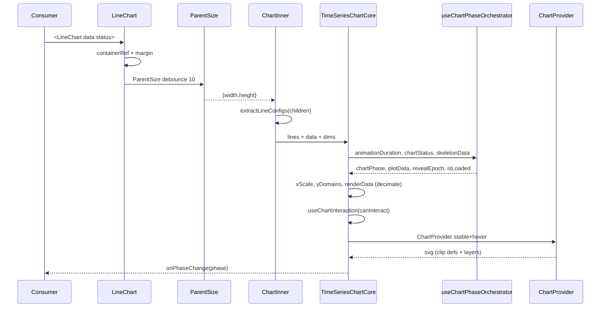

# 01 — Chart Load Flow

## Entry points

| Component | File | Export |
|-----------|------|--------|
| `LineChart` | `packages/ui/src/charts/line-chart.tsx:213` | `index.ts:313` |
| `AreaChart` | `packages/ui/src/charts/area-chart.tsx` | `index.ts:24` |
| `BarChart` | `packages/ui/src/charts/bar-chart.tsx:672` | `index.ts:38` |
| `ScatterChart` | `packages/ui/src/charts/scatter-chart.tsx:139` | `index.ts:512` |
| `CandlestickChart` | `packages/ui/src/charts/candlestick-chart.tsx:372` | `index.ts:74` |
| `ComposedChart` | `packages/ui/src/charts/composed-chart.tsx` | `index.ts:191` |
| `LiveLineChart` | `packages/ui/src/charts/live-line-chart.tsx` | `index.ts:337` |

All are `"use client"` (`line-chart.tsx:1`, `bar-chart.tsx:1`, `chart-context.tsx:1`). No SSR rendering of SVG — client gates inside.

## Mount gate (ResizeObserver)

```
<div relative + containerRef>           // line-chart.tsx:256, bar-chart.tsx:696
  └─ ParentSize debounceTime={10}       // line-chart.tsx:265, bar-chart.tsx:701
       └─ ChartInner {width,height}     // line-chart.tsx:162, bar-chart.tsx:168
            └─ null if width<10||h<10  // time-series-chart-shell.tsx:172, bar-chart.tsx:170
```

| Mechanism | Detail |
|-----------|--------|
| Observer | `@visx/responsive.ParentSize` (`bar-chart.tsx:4`, `line-chart.tsx:3`) or `react-use-measure` (`scatter-chart.tsx:12,154` `debounce:10`) |
| Aspect | `style={{aspectRatio}}` default `"2 / 1"` (`line-chart.tsx:221,259`, `bar-chart.tsx:680,699`) — removed if undefined (`line-chart.tsx:260`) |
| Guard | Early `return null` in `TimeSeriesChartCore` / `ChartInner` prevents scale domain errors before measurement |
| Reflow cost | `debounceTime={10}` coalesces resize → one state update; `maxRenderPointsForWidth` recomputes on `innerWidth` change (`time-series-chart-shell.tsx:313`) |

`ScatterChart` uses `react-use-measure` instead of `ParentSize` (`scatter-chart.tsx:154-162`) — same 10 ms debounce, but width/height come from `bounds`, gated by `width>0 && height>0` (`scatter-chart.tsx:170`).

## Data injection & config extraction

| Step | Where | Notes |
|------|-------|-------|
| `data` prop | `line-chart.tsx:30`, `bar-chart.tsx:60`, `candlestick-chart.tsx:46` — `Record<string,unknown>[]` (or typed OHLC) | Passed verbatim; no fetch inside chart |
| `xDataKey` | default `"date"` for time series (`line-chart.tsx:32`), `"name"` for bars (`bar-chart.tsx:62`) | Drives `xAccessor` (`time-series-chart-shell.tsx:259`, `bar-chart.tsx:212`) |
| Line configs | `extractLineConfigs(children)` (`line-chart.tsx:108`) walks `Children` recursively; `Line` registers (`line-chart.tsx:98`), others excluded via `LINE_DOMAIN_EXCLUDED_NAMES` (`line-chart.tsx:71`) | `BarChart` equivalent: `extractBarConfigs` (`bar-chart.tsx:103`), `ScatterChart`: `extractScatterConfigs` (`scatter-chart.tsx:47`) |
| Reference areas | `extractReferenceAreaConfigs(children)` (`time-series-chart-shell.tsx:498`) + live registry (`ReferenceAreaRegistrationContext` `time-series-chart-shell.tsx:456-493`) | Merged into `contextValue.referenceAreas` |
| `xDomain` | Optional brush prop (`line-chart.tsx:55`, `candlestick-chart.tsx:67`) forwarded into scale domain (`time-series-chart-shell.tsx:284-289`) | When set, `xDomainSlotCount` preserves `columnWidth` (`time-series-chart-shell.tsx:317-326`) |

`TimeSeriesChartShell` derives `renderData` via LTTB decimation: `decimateTimeSeries(seriesSourceData, maxRenderPointsForWidth(innerWidth))` (`time-series-chart-shell.tsx:308-315`, `decimate-time-series.ts:5,88`). `CandlestickChart` uses `decimateOhlcData` (`candlestick-chart.tsx:191`, `decimate-time-series.ts:93`).

## Context bootstrap

`ChartProvider` (`chart-context.tsx:239`) splits merged `ChartContextValue` into two memoized slices:

| Slice | Context | Fields | Consumer |
|-------|---------|--------|----------|
| Stable | `ChartStableContext` (`chart-context.tsx:230`) | `data`, `renderData`, `xScale`, `yScales`, `width/height`, `margin`, `lines`, `chartPhase`, `isLoaded`, `xAccessor`, … (`chart-context.tsx:246-337`) | `useChartStable()` (`chart-context.tsx:376`) — axes, grid, series |
| Hover | `ChartHoverContext` (`chart-context.tsx:231`) | `tooltipData`, `setTooltipData`, `selection`, `hoveredBarIndex`, `hoveredCandleIndex` (`chart-context.tsx:339-360`) | `useChartHover()` (`chart-context.tsx:402`) — tooltip, highlight |

`useChart()` (`chart-context.tsx:419`) merges both (re-renders on every hover). Cold consumers (`Grid`, `YAxis`) use `useChartStable` to avoid per-frame work; hot consumers (`SeriesHighlightLayer`, `ChartTooltip`) subscribe to hover.

Y-scales are multi-axis: `buildYScalesFromDomains({domainsByAxis, innerHeight})` (`y-axis-scales.ts:79`, `time-series-chart-shell.tsx:386`) keyed by `yAxisId` (`y-axis-scales.ts:9`). `bar-chart.tsx:293` builds per-axis via `buildYScalesForLines` or `wrapSingleYScale` for horizontal.

## Phase / reveal state machine

Status `ChartStatus = "loading"|"ready"` (`chart-phase.ts:2`) maps to `ChartPhase` 8-state enum (`chart-phase.ts:12-20`):

```
loading → exiting → gridTweenReady → revealing → ready
ready   → exitingReady → gridTweenLoading → loading
                              ↘ revealingLoading
```

| Hook | File | Role |
|------|------|------|
| `useChartPhaseOrchestrator` | `use-chart-phase-orchestrator.ts:22` | Owns `chartPhase`, `plotData`, `revealEpoch`, `concealEpoch`, `isLoaded` |
| `resolveRestingChartPhase` | `chart-phase.ts:31` | Initial phase from `status` |
| `isChartInteractionPhase` | `chart-phase.ts:35` | Gates `canInteract` (`time-series-chart-shell.tsx:406`) |
| `isYDomainTweenPhase` | `y-domain-utils.ts:46` | Guards tween branches |

Branching on `animationDuration`/`yDomainTweenDuration` (`use-chart-phase-orchestrator.ts:54-80`): zero duration short-circuits animation. `revealSignature` change while `chartPhase==="ready"` replays `"revealing"` (`use-chart-phase-orchestrator.ts:90-103`).

`plotData` switches: `"loading"/"exiting"` → `skeletonData`, others → `targetData` (`use-chart-phase-orchestrator.ts:106-125`). Skeleton generation: `generateChartSkeletonFromTarget` mirrors target dates with lower magnitudes (`generate-chart-skeleton-data.ts:32`), fallback `generateChartSkeletonData` 7-point sine (`generate-chart-skeleton-data.ts:14`).

`BarChart` has lighter machine: `revealEpoch` bump + `setTimeout(animationDuration)` (`bar-chart.tsx:373-386`), no y-tween.

### Y-domain animation

`TimeSeriesChartShell` computes `yDomainSkeletonByAxis` / `yDomainTargetByAxis` via `computeYDomainsByAxis` + `niceYDomain` (`time-series-chart-shell.tsx:328-371`, `y-domain-utils.ts:9`). `useAnimatedYDomains` (`use-animated-y-domains.ts:124`) lerps domains via `motion.animate` when phase is `gridTween*` (`use-animated-y-domains.ts:188`) or when `tweenOnTargetChange` and target changes in `"ready"` (`use-animated-y-domains.ts:204-238`).

Clip reveal: single shared `<ChartRevealClip>` in `TimeSeriesChartShell` (`time-series-chart-shell.tsx:653-667`) — `<motion.rect width>` (`chart-reveal-clip.tsx:80`) with `revealEpoch`/`concealEpoch` keys (`time-series-chart-shell.tsx:664-665`).

## SSR / lazy behavior

| Concern | Behavior |
|---------|----------|
| SSR | Every chart file is `"use client"`; no server SVG. `ParentSize` requires DOM. `XAxis`/`YAxis`/`ChartTooltip` use `createPortal` gated by `mounted` (`x-axis.tsx:562-569`, `y-axis.tsx:78-86`, `tooltip/chart-tooltip.tsx:362-369`) + `containerRef.current` check. `useEffect` for reveal timers (`use-chart-phase-orchestrator.ts:45`) and measure never runs on server. |
| Lazy | No `dynamic()` inside package; consumer lazy-loads chart components. `isLoaded` flag gates interaction handlers until `animationDuration` timeout (`time-series-chart-shell.tsx:406`). |
| Static preview | `StaticChartPreviewProvider` (`static-chart-preview-context.tsx`) + `skipEnterReveal` (`time-series-chart-shell.tsx:250`) disables `revealing` for docs screenshots (`use-chart-phase-orchestrator.ts:91`). |

## Load sequence (mermaid)


