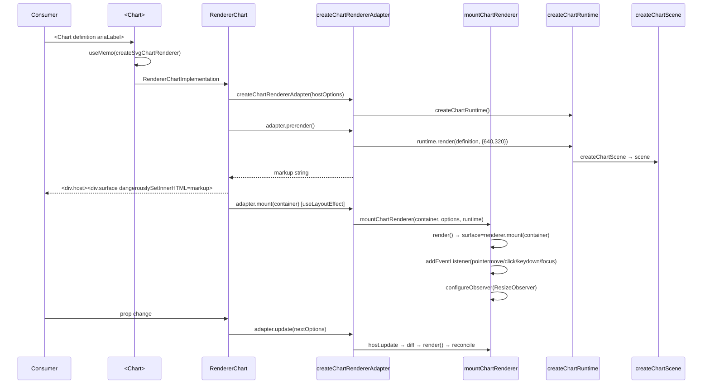

# 01 — Chart Load Flow

## Entry: `defineChart`

| Overload | File | Notes |
|----------|------|-------|
| `defineChart({marks, x, y, color, …})` | `packages/charts-core/src/scene.ts:88` | Static spec — marks array + `ChartDefinitionOptions` |
| `defineChart(config: {chart: (ctx)=>CheckedChartSpec})` | `packages/charts-core/src/scene.ts:104` | Dynamic — function receives `{width,height,theme}` (`packages/charts-core/src/types.ts:422`) |
| `defineChart(definition, options)` | `packages/charts-core/src/scene.ts:121` | Merge form — spreads `options` over existing definition |

Static path stores `marks`, `x`/`y` axis options, `color`, `gradients`, `clip`, `margin`, `theme` plus `StoredChartDefinitionOptions` (`packages/charts-core/src/types.ts:272`) — `maxFocusDistance`, `focus`, `spatialIndex`, `animate`, `keyboard`, `tooltip`. Dynamic `chart(ctx)` is invoked inside `createChartRuntime().render` (`packages/charts-core/src/runtime.ts:25`).

## React entry wrappers

| Component | File | Responsibility |
|-----------|------|----------------|
| `<Chart>` | `packages/react-charts/src/Chart.tsx:42` | Memoizes `createSvgChartRenderer(renderSvg)` (`Chart.tsx:47`), adapts `onRender` to `SVGSVGElement`, forwards to `RendererChartImplementation` |
| `<RendererChart>` / `RendererChartImplementation` | `packages/react-charts/src/RendererChart.tsx:54,71` | Owns adapter lifecycle, host `div`, `ChartSurface`, tooltip portal |

`Chart` is the public API; `RendererChart` is the renderer-generic variant accepting `renderer: ChartRenderer` (`packages/react-charts/src/RendererChart.tsx:30`). Both share `ChartCommonProps` (`Chart.tsx:12`) — `ariaLabel`, `height`/`aspectRatio`/`width`/`initialWidth`, `renderSvg`, `measureText`, callbacks.

## Adapter layer

| Adapter | File | Contract |
|---------|------|----------|
| `createChartAdapter` | `packages/charts-core/src/adapter.ts:18` | Wraps `mountChart` (`packages/charts-core/src/dom.ts:14`) — default SVG via `createSvgChartRenderer` |
| `createChartRendererAdapter` | `packages/charts-core/src/adapter-renderer.ts:14` | Renderer-generic — takes `options.renderer` as-is |

Both implement `ChartAdapter<TOptions>` (`packages/charts-core/src/adapter-shared.ts:13`) — `prerender(): string`, `mount(container)`, `update(nextOptions)`, `getScene()`, `destroy()`.

`resolveChartAdapterLayout` (`packages/charts-core/src/adapter-shared.ts:22`) normalizes sizing for prerender:

```
initialWidth  = width ?? initialWidth ?? 640
initialHeight = height ?? (aspectRatio ? initialWidth/aspectRatio : 320)
```

## `mountChartRenderer` — the host

`mountChartRenderer(container, initialOptions, runtime)` (`packages/charts-core/src/renderer.ts:34`) owns the full lifecycle:

| State | Var | Initial |
|-------|-----|---------|
| `options` | closed-over `let options` | `initialOptions` |
| `scene` | `let scene!: ChartScene` | set by first `render()` |
| `surface` | `ChartSurface \| undefined` | created on first `render` via `options.renderer.mount(container, scheduleRender)` (`renderer.ts:106`) |
| `focusedPoint` / `pinnedKey` | interaction state | `null` |
| `observer` / `renderFrame` | resize + rAF | `undefined` |

### Size resolution (`createScene` + `currentWidth`)

```ts
// packages/charts-core/src/renderer.ts:184, 345
currentWidth = () => options.width ?? container.getBoundingClientRect().width
width  = currentWidth() ?? options.initialWidth ?? 640   // createScene:345
height = options.height ?? (aspectRatio ? width/aspectRatio : 320) // 353
```

- `width` prop pins width; otherwise live `getBoundingClientRect().width` (`renderer.ts:186`).
- `options.width !== undefined || width > 0 ? width : undefined` guards zero-width containers (`renderer.ts:187`).
- Fallback `640×320` matches `resolveChartAdapterLayout`.

### `configureObserver` (`renderer.ts:190`)

Creates `ResizeObserver` only when `options.width === undefined`; observes `container`; on width change `scheduleRender(false,'resize')`.

`nextWidth === scene.width` short-circuit avoids redundant renders (`renderer.ts:198`).

### `scheduleRender` (`renderer.ts:205`) — rAF coalescing

```
scheduleRender(force, reason) ──► forceScheduledRender ||= force
                                 scheduledRenderReason = layout>resize>update
                                 if renderFrame pending → return
                                 requestAnimationFrame → render(refreshText, reason)
```

Fallback when `requestAnimationFrame` unavailable: render synchronously (`renderer.ts:215`).

## Prerender vs mount vs update

| Phase | Method | What happens | When |
|-------|--------|--------------|------|
| **Prerender** | `adapter.prerender()` (`adapter-renderer.ts:27`) | `resolveChartAdapterLayout` → `runtime.render(definition, {width:initialWidth, height:initialHeight}, {measureText})` → `renderer.prerender(scene, {ariaLabel,…tabIndex})` → SVG string | First render, before DOM; used for SSR string (`RendererChart.tsx:148`) |
| **Mount** | `adapter.mount(container)` (`adapter-renderer.ts:42`) | `mountChartRenderer(container, options, runtime)` → attaches listeners (`pointermove`,`click`,`keydown`,`focusin/out`), `render()`, `configureObserver()`, `fontSet loadingdone` (`renderer.ts:431`) | `useLayoutEffect` on mount (`RendererChart.tsx:150`) |
| **Update** | `adapter.update(nextOptions)` (`adapter-renderer.ts:47`) | `options=nextOptions` → diffs `definition/size/layout/aria` → `render(false, 'update'/'resize'/'layout')` else repaint focus only (`renderer.ts:303`); re-configures observer if `width` changed | `useLayoutEffect` on `hostOptions` change (`RendererChart.tsx:156`) |
| **Destroy** | `adapter.destroy()` (`adapter-renderer.ts:54`) | `observer.disconnect`, `cancelAnimationFrame(renderFrame)`, `destroyTooltip()`, `surface.destroy()`, `runtime.destroy()`, remove listeners, `container.replaceChildren()`, restore `position` (`renderer.ts:344`) | Effect cleanup (`RendererChart.tsx:154`) |

Isomorphic handoff: `RendererChartImplementation` captures `initialMarkupRef.current ??= adapter.prerender()` synchronously during render (`RendererChart.tsx:148`), passes as `markup` to `ChartSurface` for first paint before `mount` replaces it via reconcile.

## Data / definition injection

- No fetch inside charts — `definition` carries `marks` which close over `data` via accessors/channels (`packages/charts-core/src/types.ts:383`).
- `runtime.render(definition, size, {measureText})` (`renderer.ts:101`) calls `createChartScene` for static definitions or invokes `definition.chart({width,height,theme:defaultChartTheme})` for dynamic ones (`runtime.ts:29`).
- `measureText` injection: `options.measureText ?? domText.measureText` (`renderer.ts:357`); `domText = createDomTextMeasurer(container)` (`renderer.ts:69`) — Canvas `measureText` with cache, falls back to `estimateSceneText` (`packages/charts-core/src/dom-text.ts:18`).

## Theme & margin context

`defaultChartTheme` (`packages/charts-core/src/scene.ts:13`) — `foreground/muted/grid/background` + 6 CSS-var palette (`--ts-chart-1` etc.). Merged `theme: {...defaultChartTheme, ...definition.theme}` (`scene.ts:131`). Guides/margins computed in `resolveSceneLayout` (`scene.ts:158`) — iterative 4-pass layout measuring label bounds via `measureText` (`scene.ts:334`).

## SSR / isomorphic path

| Concern | Behavior |
|---------|----------|
| SSR string | `adapter.prerender()` runs without DOM container — pure `runtime.render` + `renderer.prerender` (`adapter-renderer.ts:27`) |
| React SSR | `initialMarkupRef` rendered as `dangerouslySetInnerHTML` (`RendererChart.tsx:29`) — no `useLayoutEffect` on server |
| Hydration | Client `mount` calls `reconcileChartSvg` which diffs existing SSR markup vs fresh `renderSvg(scene)` (`packages/charts-core/src/reconcile.ts:20`) |
| Portal/tooltip | Created in `renderer.ts:400` via `document.createElement` — never SSR'd; `renderTooltipBody` portal via `createPortal` (`RendererChart.tsx:162`) after mount |

## Load sequence


